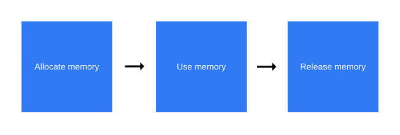
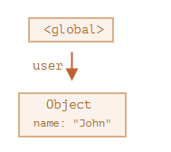
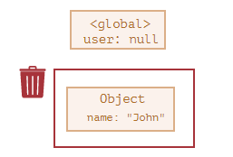
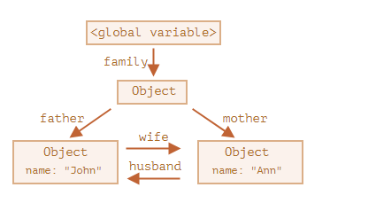
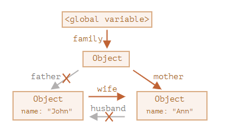
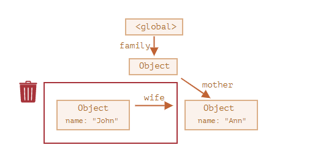
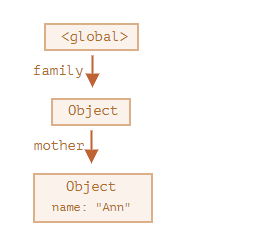
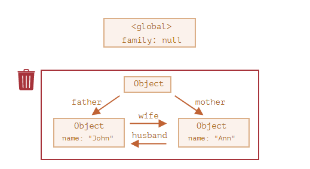

>由于字符串、对象和数组没有固定大小，所有当他们的大小已知时，才能对他们进行动态的存储分配。JavaScript程序每次创建字符串、数组或对象时，解释器都必须分配内存来存储那个实体。只要像这样动态地分配了内存，最终都要释放这些内存以便他们能够被再用，否则，JavaScript的解释器将会消耗完系统中所有可用的内存，造成系统崩溃。  --《JavaScript权威指南（第四版）》

### 简介

像 C 语言这样的底层语言一般都有底层的内存管理接口，比如 malloc()和free()。相反，JavaScript 是在创建变量（对象，字符串等）时自动进行了分配内存，并且在不使用它们时“自动”释放。释放的过程称为垃圾回收。

### 内存生命周期

不管什么程序语言，内存生命周期基本是一致的：



1. **内存分配** -- 分配你所需要的内存
2. **内存使用** -- 使用分配到的内存（读、写）
3. **内存释放** — 释放你明确不需要的内存，让其再次空闲和可用。


### JavaScript 的内存分配

#### 值的初始化
JavaScript 在定义变量时就完成了内存分配。
```js
var n = 123; // 给数值变量分配内存
var s = "azerty"; // 给字符串分配内存

var o = {
  a: 1,
  b: null
}; // 给对象及其包含的值分配内存

// 给数组及其包含的值分配内存（就像对象一样）
var a = [1, null, "abra"];

function f(a){
  return a + 2;
} // 给函数（可调用的对象）分配内存

// 函数表达式也能分配一个对象
someElement.addEventListener('click', function(){
  someElement.style.backgroundColor = 'blue';
}, false);

```
#### 通过函数调用分配内存
有些函数调用结果是分配对象内存：
```js
var d = new Date(); // 分配一个 Date 对象

var e = document.createElement('div'); // 分配一个 DOM 元素

```
有些方法分配新变量或者新对象：
```js
var s = "azerty";
var s2 = s.substr(0, 3); // s2 是一个新的字符串
// 因为字符串是不变量，
// JavaScript 可能决定不分配内存，
// 只是存储了 [0-3] 的范围。

var a = ["ouais ouais", "nan nan"];
var a2 = ["generation", "nan nan"];
var a3 = a.concat(a2);
// 新数组有四个元素，是 a 连接 a2 的结果
```
#### 使用值
使用值的过程实际上是对分配内存进行读取与写入的操作。读取与写入可能是写入一个变量或者一个对象的属性值，甚至传递函数的参数。

#### 当内存不再需要使用时释放
大多数内存管理的问题都在这个阶段。在这里最艰难的任务是找到“哪些被分配的内存确实已经不再需要了”。它往往要求开发人员来确定在程序中哪一块内存不再需要并且释放它。

高级语言解释器嵌入了“垃圾回收器”，它的主要工作是跟踪内存的分配和使用，以便当分配的内存不再使用时，自动释放它。这只能是一个近似的过程，因为要知道是否仍然需要某块内存是无法判定的（无法通过某种算法解决）。


### 垃圾回收
自动寻找是否一些内存“不再需要”的问题是无法判定的。因此，垃圾回收实现只能有限制的解决一般问题。主要的垃圾回收算法都有局限性。

#### 引用计数

这是最初级的垃圾收集算法。此算法把“对象是否不再需要”简化定义为“对象有没有其他对象引用到它”。如果没有引用指向该对象（零引用），对象将被垃圾回收机制回收。

```js
var arr = [1, 2, 3, 4];  // [1, 2, 3, 4] 被变量arr引用, 引用次数+1 => 1
arr = () => {};  // 变量arr 引用了一个函数， [1, 2, 3, 4] 引用次数-1 => 0  [1, 2, 3, 4]占用空间被回收
```
**问题**：循环引用

```js
function f(){
  var obj1 = {};
  var obj2 = {};
  obj1.a = obj2; // o 引用 o2
  obj2.a = obj1; // o2 引用 o

  return "abc";
}

f();

```
当函数 func 执行结束后，返回值为 undefined，所以整个函数以及内部的变量都应该被回收，但根据引用计数方法，obj1 和 obj2 的引用次数都不为 0，所以他们不会被回收。

要解决循环引用的问题，最好是在不使用它们的时候手工将它们设为空

```js
obj1 = null;
obj2 = null;
```

#### 标记清除
定期执行以下“垃圾回收”步骤：
- 垃圾收集器找到所有的根，并“标记”（记住）它们。
- 然后它遍历并“标记”来自它们的所有引用。
- 然后它遍历标记的对象并标记 它们的 引用。所有被遍历到的对象都会被记住，以免将来再次遍历到同一个对象。
- ……如此操作，直到所有可达的（从根部）引用都被访问到。
- 没有被标记的对象都会被删除。

JavaScript 中主要的内存管理概念是 **可达性**。

简而言之，“可达”值是那些以某种方式可访问或可用的值。它们一定是存储在内存中的。

**一个简单的例子**

```js
// user 具有对这个对象的引用
let user = {
  name: "John"
};
```


变量 `"user"` 引用了对象 `{name："John"}`

如果 `user` 的值被重写了，这个引用就没了：

```js
user = null;
```

对象`{name："John"}`变成不可达的了。因为没有引用了，就不能访问到它了。垃圾回收器会认为它是垃圾数据并进行回收，然后释放内存。

**相互关联的对象**
一个更复杂的例子
```js
function marry(man, woman) {
  woman.husband = man;
  man.wife = woman;

  return {
    father: man,
    mother: woman
  }
}

let family = marry({
  name: "John"
}, {
  name: "Ann"
});
```
`marry` 函数通过让两个对象相互引用使它们“结婚”了，并返回了一个包含这两个对象的新对象。

由此产生的内存结构：


到目前为止，所有对象都是可达的。

现在让我们移除两个引用：

```js
delete family.father;
delete family.mother.husband;
```


仅删除这两个引用中的一个是不够的，因为所有的对象仍然都是可达的。

但是，如果我们把这两个都删除，那么我们可以看到再也没有对 John 的引用了：



对外引用不重要，只有传入引用才可以使对象可达。所以，John 现在是不可达的，并且将被从内存中删除，同时 John 的所有数据也将变得不可达。

经过垃圾回收：



**无法到达的岛屿**
几个对象相互引用，但外部没有对其任意对象的引用，这些对象也可能是不可达的，并被从内存中删除。
```js
family = null;
```



**优化措施**

- **分代收集（Generational collection）**—— 对象被分成两组：“新的”和“旧的”。在典型的代码中，许多对象的生命周期都很短：它们出现、完成它们的工作并很快死去，因此在这种情况下跟踪新对象并将其从内存中清除是有意义的。那些长期存活的对象会变得“老旧”，并且被检查的频次也会降低。
- **增量收集（Incremental collection）**—— 如果有许多对象，并且我们试图一次遍历并标记整个对象集，则可能需要一些时间，并在执行过程中带来明显的延迟。因此，引擎将现有的整个对象集拆分为多个部分，然后将这些部分逐一清除。这样就会有很多小型的垃圾收集，而不是一个大型的。这需要它们之间有额外的标记来追踪变化，但是这样会带来许多微小的延迟而不是一个大的延迟。
- **闲时收集（Idle-time collection）**—— 垃圾收集器只会在 CPU 空闲时尝试运行，以减少可能对代码执行的影响。

### 参考
1. [内存管理](https://developer.mozilla.org/zh-CN/docs/Web/JavaScript/Memory_Management)
2. [垃圾回收](https://zh.javascript.info/garbage-collection)
