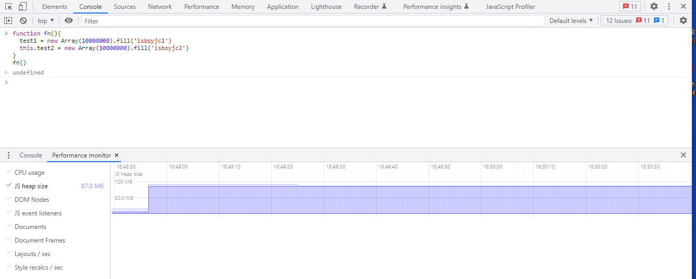
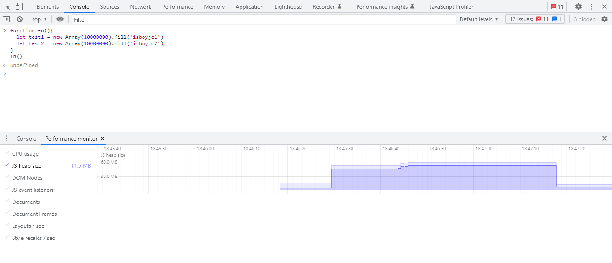
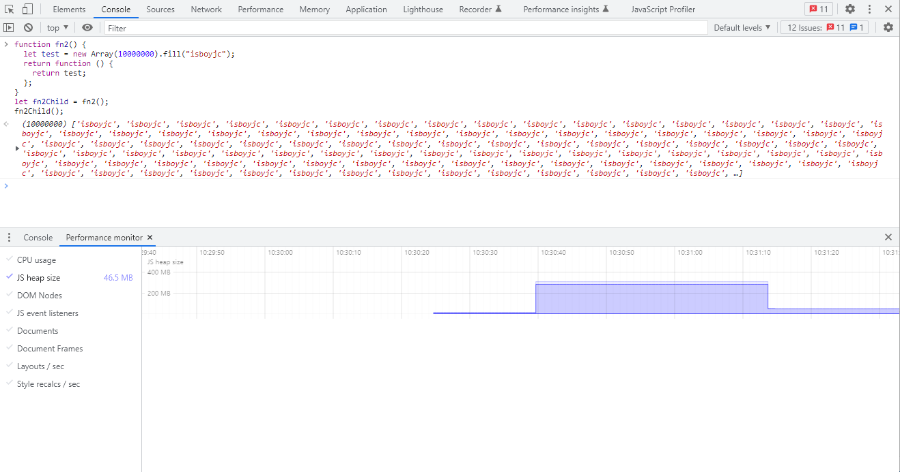
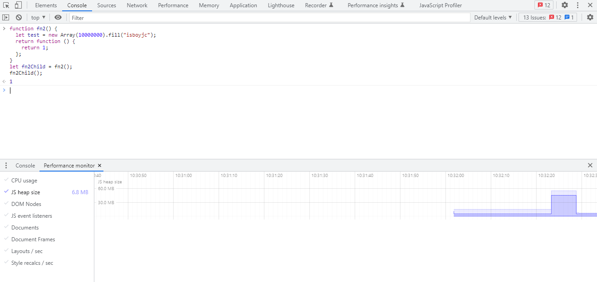

分析下网上常说的几种Javascript内存泄漏方式，前置知识：Javascript内存回收方式是标记清除法。

## 常见的内存泄漏方式分析

### 全局变量
全局变量标记不能被清除，会一直占用内存
```js
function fn(){
  test1 = new Array(10000000).fill('isboyjc1')
  this.test2 = new Array(10000000).fill('isboyjc2')
}
fn()
```


局部变量没有引用会再下次gc时被清除
```js
function fn(){
  let test1 = new Array(10000000).fill('isboyjc1')
  let test2 = new Array(10000000).fill('isboyjc2')
}
fn()
```


### 游离DOM引用
代码中进行 DOM 时会使用变量缓存 DOM 节点的引用，但移除节点的时候，我们应该同步释放缓存的引用，否则游离的子树无法释放。
```html
<div id="root">
  <ul id="ul">
    <li></li>
    <li></li>
    <li id="li3"></li>
    <li></li>
  </ul>
</div>
<script>
  let root = document.querySelector('#root')
  let ul = document.querySelector('#ul')
  let li3 = document.querySelector('#li3')
  
  // 由于ul变量存在，整个ul及其子元素都不能GC
  root.removeChild(ul)
  
  // 虽置空了ul变量，但由于li3变量引用ul的子节点，所以ul元素依然不能被GC
  ul = null
  
  // 已无变量引用，此时可以GC
  li3 = null
</script>
```

### 未清理的console
浏览器保存了对象的引用，未清理的 `console` 如果输出了对象也会造成内存泄漏

### 遗忘的定时器和事件监听器
`addEventListener`、`setTimeout` 、 `setInterval`和`requestAnimationFrame`等。

```js
 window.addEventListener("resize", this.doSomething)
 window.removeEventListener("resize", this.doSomething)


let someResource = getData()
setInterval(() => {
  const node = document.getElementById('Node')
	if(node) {
    node.innerHTML = JSON.stringify(someResource))
	}
}, 1000)
```

### 闭包
**闭包并不会引发内存泄漏**
由于IE9 之前的版本对JScript 对象和COM 对象使用不同的垃圾收集。因此闭包在IE 的这些版本中会导致一些特殊的问题。具体来说，如果闭包的作用域链中保存着一个HTML 元素，那么就意味着该元素将无法被销毁：
```js
function assignHandler() {
  var element = document.getElementById("someElement");
  element.onclick = function () {
    alert(element.id);
  };
}
```
看两个例子反证一下：




## 内存监测

### Performance.memory(已弃用)

浏览器在 `performance` 对象上加上了 `memory` 属性，通过获取 `performance.memory` 可以得到一组当前页面使用内存数据的信息。具体如下：
- `jsHeapSizeLimit`：表示当前页面最多可以获得的 JavaScript 堆大小；
- `totalJSHeapSize`：表示当前页面已经分配的 JavaScript 堆大小；
- `usedJsHeapSize`：表示当前页面 JavaScript 已经使用的堆大小。

这里，三个值的单位是字节（byte），且有恒定的不等式：`jsHeapSizeLimit` >= `totalJSHeapSize` >= `usedJsHeapSize`。

浏览器在分配内存的时候，会一次性向系统申请一块内存，然后在 JavaScript 需要的时候直接提供使用，因而 `totalJSHeapSize` 总是大于 `usedJsHeapSize` 的。如果 JavaScript 需要的内存多于已经申请的量，就会继续申请一块，直到达到 `jsHeapSizeLimit` 的上限，触发页面崩溃。

通过观察 `jsHeapSizeLimit` 和 `totalJSHeapSize` 这两个字段，可以用于监控当前的页面是否有耗尽内存的危险；同时，如果内存一直在涨，不见回落，很可能需要排查是否有潜在的内存泄漏危险。

需要注意的几点：
1. 出于安全方面的考虑，API 并不会给出非常准确的数据，并且给出的数据会额外加上一些干扰([参考这个](https://github.com/WICG/performance-memory/blob/master/explainer.md#security)，以及这个[改动](https://bugs.webkit.org/attachment.cgi?id=154876&action=prettypatch))；
   (经过测试定时1s获取是可以的，40ms则不行)

2. 如果需要 Chrome 给出精确的内存数据，可以在启动的时候加上 --enable-precise-memory-info；

3. `performance.memory` 无法通过 `JSON.stringify` 获取到数据（结果是 `{}`），一些分析和解决办法可以参考[这篇文章](https://medium.com/@iamoryanmoshe/the-object-that-misbehaved-window-performance-memory-fe338736aed0)。

### performance.measureUserAgentSpecificMemory()

周期调用以跟踪内存使用情况在会话期间的变化情况。

**安全要求**需要在响应头中开启这个
```sh
Cross-Origin-Opener-Policy: same-origin
Cross-Origin-Embedder-Policy: require-corp
```
可以这样监测跨源隔离是否成功
```js
if (crossOriginIsolated) {
  // Use measureUserAgentSpecificMemory
}
```

**监视内存使用情况** ：可以使用指数分布随机每隔五分钟调用

```js
function runMemoryMeasurements() {
  const interval = -Math.log(Math.random()) * 5 * 60 * 1000;
  console.log(`Next measurement in ${Math.round(interval / 1000)} seconds.`);
  setTimeout(measureMemory, interval);
}

async function measureMemory() {
  const memorySample = await performance.measureUserAgentSpecificMemory();
  console.log(memorySample);
  runMemoryMeasurements();
}

if (crossOriginIsolated) {
  runMemoryMeasurements();
}
```
### 区别

主要区别在于 `performance.memory` 返回 JavaScript 堆的大小，而 `performance.measureUserAgentSpecificMemory` 只返回当前网页使用的内存。

### 参考
1. [你的程序中可能存在内存泄漏](https://juejin.cn/post/6984188410659340324#heading-4)
2. [闭包会造成内存泄漏吗？](https://www.finclip.com/news/f/296.html)
3. [有效管理 Gmail 规模的内存](https://web.dev/effectivemanagement/)
4. [Performance.memory](https://developer.mozilla.org/en-US/docs/Web/API/Performance/memory)
5. [performance.measureUserAgentSpecificMemory](https://developer.mozilla.org/en-US/docs/Web/API/Performance/measureUserAgentSpecificMemory)
6. [了不起的Chrome浏览器：Chrome 89开启Web应用的物联网时代](https://segmentfault.com/a/1190000039415942)
7. [monitor-total-page-memory-usage](https://web.dev/monitor-total-page-memory-usage/)
8. [Performance Memory](https://laysent.com/til/2019-12-30_performance-memory)