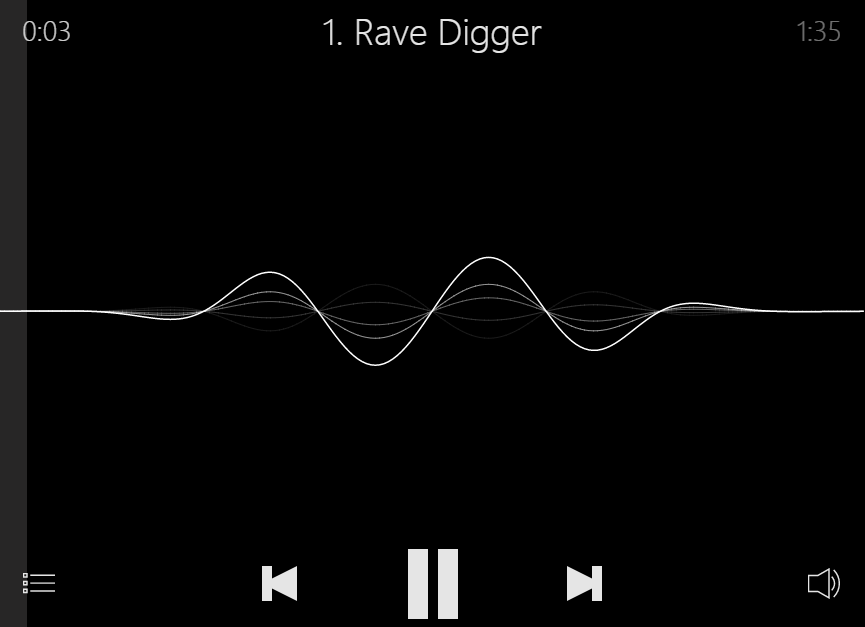
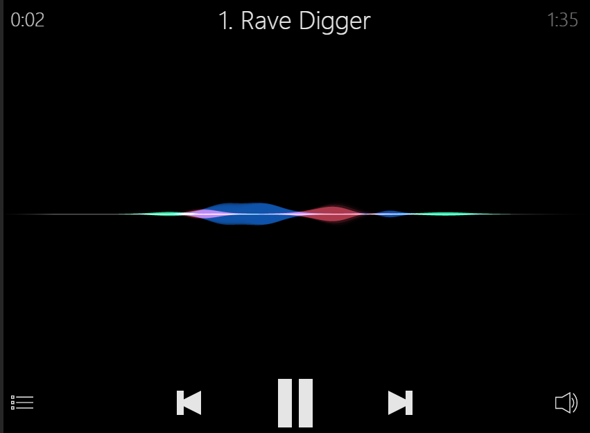
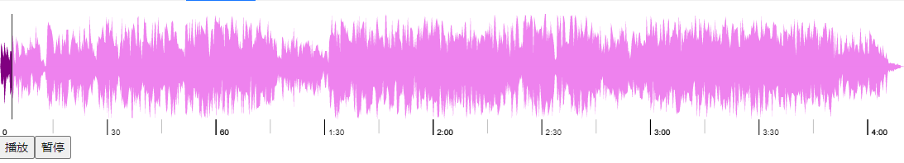
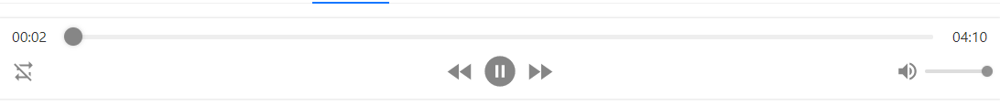

## 前端音频录制和播放方案

### 目的
业务需要，前端需要进行音频的录制和播放。

### 方案
#### 音频录制
[recordrtc](https://recordrtc.org/) 是一个成熟的前端音视频桌面录制库，可以选用这个库来处理，可以每隔几秒上传下录制的内容

``` ts
let stream = await navigator.mediaDevices.getUserMedia({audio: true}); // 获取权限
let recorder = new RecordRTCPromisesHandler(stream, {
    type: 'audio',
    timeSlice: 1000, // 时间切片
    ondataavailable: (data) => { // 时间切片回调
      console.log(data);
    }
});
recorder.startRecording(); // 开始录制

const sleep = m => new Promise(r => setTimeout(r, m));
await sleep(3000);

await recorder.stopRecording();  // 暂停录制
let blob = await recorder.getBlob();
invokeSaveAsDialog(blob);  // 保存完整文件

```
#### 音频播放
录制的音频格式可以使用原生的`audio`标签进行播放，考虑到美观性，可以使用一些三方件来做处理。

1. `ios`音频样式 [howler](https://howlerjs.com/)


2. 波形可视化 [wavesurfer](https://wavesurfer-js.org/)
  
3. 通用的样式 [react-h5-audio-player](https://www.npmjs.com/package/react-h5-audio-player)
  

### 参考

1. [recordrtc](https://recordrtc.org/)
2. [howler](https://howlerjs.com/)
3. [wavesurfer](https://wavesurfer-js.org/)
4. [react-h5-audio-player](https://www.npmjs.com/package/react-h5-audio-player)

