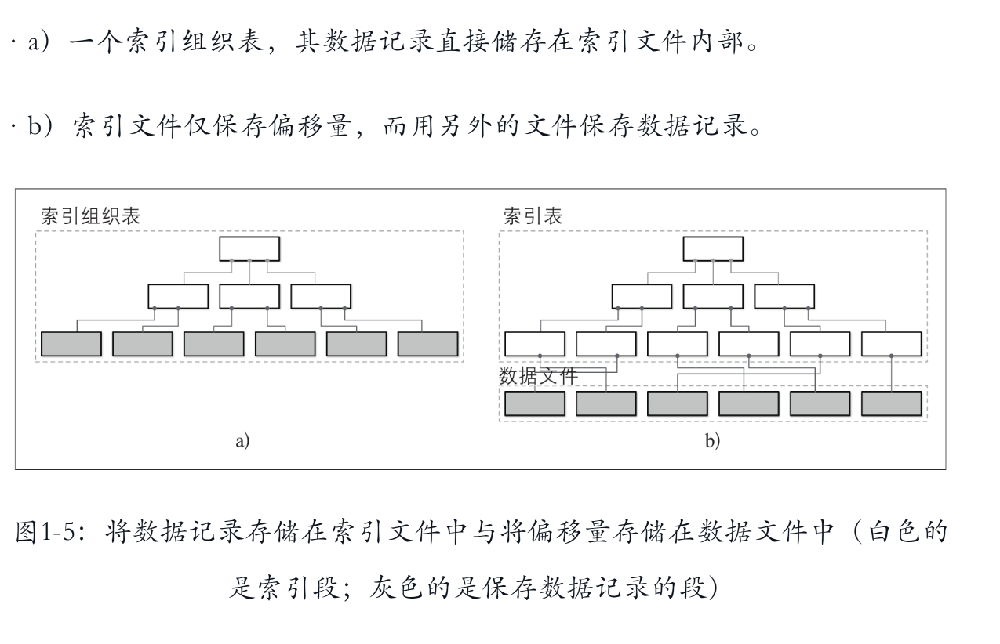

## 数据存储与检索背景

数据处理大致可以分成两大类：联机事务处理OLTP（on-line transaction processing）、联机分析处理OLAP（On-Line Analytical Processing）。OLTP是传统的关系型数据库的主要应用，主要是基本的、日常的事务处理，例如银行交易。OLAP是数据仓库系统的主要应用，支持复杂的分析操作，侧重决策支持，并且提供直观易懂的查询结果。

| 维度 | OLTP(online transaction processing) | OLAP(online analysis processing) |
| --- | --- | --- |
| 系统功能 | 日常交易处理/在线失误处理 | 统计、分析、报表/在线分析处理 |
| 设计目标 | 面向实时交易类应用 | 面向统计分析类应用  |
| 数据处理 | 当前的、最新的 | 历史的、聚集的 |
| 实时性 | 实时性读写要求高 | 实时性读写要求低 |
| 事务 | 强事务 | 弱事务 |
| 分析要求 | 低、简单 | 高、复杂 |

## OLTP

大多数OLTP系统中，数据存储都是以面向行(row-oriented)的方式组织的。这种方式把一行数据存放在一起。在OLAP系统中，查询语句一般是获取大量行数据中的特定某几列。

OLTP的存储引擎分为**面向页（b+tree）存储引擎**和**日志结构（lsm tree）存储引擎**

## ****数据文件和索引文件****

数据库系统的主要目的是存储数据和快速检索数据。为了实现快速检索数据会以特殊的格式来保存到文件中。特殊的存储格式可以确保：

- 存储效率最高：存储每条数据记录的额外开销最小。
- 访问效率最高：数据记录能够以最少的步骤被访问。
- 更新效率最高：对磁盘数据做最少改动就能完成记录更新。

数据库系统的表中存储了由多个字段构成的数据记录，每个表保存在一个单独的文件中。表中的每一条记录可以通过搜索键查找到，为了能快速从文件中查找到对应记录，数据库系统使用索引。索引实际上是一种特殊的数据结构，它可以帮助在数据文件中快速定位数据记录，而且不需要扫描整个数据文件中的所有数据记录。通常索引会在一个或一组能够能识别数据记录的字段上构建。

通常数据库系统的数据记录和索引是分别存储到不同文件中的：数据文件存储数据记录；而索引文件索引数据。索引文件通常比数据文件小，通过索引文件中的数据就可以快速定位数据文件中记录位置。

## **数据文件**

数据文件（有时称为主文件（primary file））通常可以用**索引组织表**（Index-Organized Table，IOT）、**堆组织表**（heap-organized table，即堆文件）或**哈希组织表**（hash-organized table，即哈希文件）来实现。

- 堆组织表(heap-organized tables)，记录不需要遵循任何特定的顺序，并且大多数情况下它们都是按写顺序放置的。这样，在追加新的页时，数据库便不需要额外的工作或文件重组。堆文件需要额外的索引结构来指向存储数据记录的位置，以使其能够被检索到。(Oracle, PostgreSQL)
- 哈希组织表（hash-organized tables），记录存储在桶中，并且键的哈希值确定记录属于哪个桶。存储在桶中的记录可以按追加顺序存储，也可以按键排序存储以提高查找速度。
- 索引组织表(Index-Organized Table) 将索引和数据记录存储在一起。由于记录是按键的顺序存储的，所以索引组织表中的范围扫描可以通过顺序扫描其内容来实现。(innoDB)

## ****索引文件****

索引是一种能帮助高效磁盘数据检索的数据结构。通常索引具有特殊的数据结构，该结构能映射键到键对应数据记录在数据文件中的位置。

主文件(数据文件)上的索引称为主索引。在大多数情况下，主索引构建在主键上，主键可以是一个键也可以是一组能标识记录的键。所有其他索引都称为辅助索引（Secondary indexes）。

辅助索引可以直接映射到数据记录位置，或者只是简单的映射到记录所对应的主键。多个辅助索引可以指向相同的记录，从而允许通过不同的字段和不同的索引来查找单个数据记录。主索引文件为每个搜索键保存唯一一个条目，而次索引可能为每个搜索键保存多个条目。

如果数据记录的顺序和搜索键的顺序一致，则此索引称为聚簇索引。这种情况下索引和的数据记录通常存储在相同的文件中。如果数据存储在单独的文件中，并且其顺序和键的顺序不一致，则该索引称非聚簇索引。

许多数据库系统都有自带显式主键对应唯一一条数据库记录。在没有指定主键的情况下，存储引擎可以创建一个隐式主键(如，MySQL InnoDB会添加一个自动递增列)。

## 辅助索引

1. 直接通过文件偏移量引用数据记录
2. 通过主键索引引用数据记录

通过直接引用数据，我们可以减少查找磁盘的次数，但在维护过程中，每当更新或重新定位记录时，我们都必须承担更新指针所带来的成本。通过主索引间接引用数据可以降低指针更新的成本，但在读取路径上成本更高。

为了减少指针更新的成本，一些数据库的具体实现是使用主键进行间接操作，而不是直接使用数据偏移量。例如，MySQL InnoDB使用主索引并执行两次查找：一次在二级索引中，一次在主索引中。这样并不直接使用二级索引查询得到的偏移量，因此增加了一次主索引的查询开销。

## 存储结构的分类

1. In-place update structure: 就地更新结构，如B树、B+树，直接覆盖旧记录来存储更新内容。
2. Out-of-place update structure：异位更新结构，如LSM树，会将更新的内容存储到新的位置，不覆盖旧的条目。

### 就地更新结构

B树，B+树等，只会存储每个记录的最新版本，一般读性能优，写入代价比较大，因为更新会导致随机IO；在早期机械硬盘结构上表现最好，所以占据了主流。

### 异位更新结构

LSM树，顺序写，写入性能更优，读取性能不太好。

SSD 上有两个显著的优势，第一个是 SSD 没有寻到时间，相比机械硬盘读性能有了很大的提升，很大程度上弥补了 lsm 数读取性能弱这一短板。第二点，SSD是基于闪存进行存储的，但闪存不能覆盖写，闪存块需要擦除才能够写入。而 lsm 数而 lsm 数追加写的写入模式天然契合了 SSD 的这种特性，从而很大程度上节省了擦除的损耗，并提升了 SSD 的使用寿命。

## 注意

存储系统中一个重要的权衡：精心选择的索引加快了读查询的速度，但是每个索引都会拖慢写入速度。