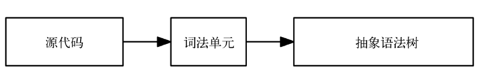

### 背景 

最近在读《用Go语言自制解释器》，由于对Go语言不是很熟悉，所以在阅读的过程中决定用typescript将代码实现一遍，加深印象。

### 词法分析器

要解释源代码，就需要对其转换成易于处理的形式，一般的步骤是：



第一步是用词法分析器将源代码转换为词法单元 ，这一 过程称为词法分析。词法分析器也称词法单元生成器或扫描器。

词法分析器本身是短小，易于分类的数据结构，它会被传给语法分析器，语法分析器会将词法单元转换成抽象语法树。

### Monkey语言 

要解释的Monkey语言如下所示：

```javascript
let ten = 10;

let add = fn(x, y) {
  x + y;
};

let result = add(five, ten);
!-/*5;
5 < 10 > 5;

if (5 < 10) {
	return true;
} else {
	return false;
}
```

### 词法分析器实现思路

1. 整体思路：

对源码进行挨个读取，去掉空格换行符等，然后进行分类： 关键字（`let if else`）、操作符（`+ - * /`）、分隔符（`, ; ( ) { }`）、标识符（ `add  x y params`）、数字（`123 45`）等。然后将读取的结果放到一个数组中，等待交给下一步的语法分析器处理。

2. 这个过程主要是个体力活，没什么技巧，先枚举出所有的词法单元，然后词法分析器会遍历输入的字符，然后逐个输出识别出的词法单元，对于Monkey语言，所有的词法分类如下：

   ```typescript
   // 非法字符和结束符
   export const ILLEGAL = "ILLEGAL";
   export const EOF = "EOF";
   
   // Identifiers + int  标识符和数字
   export const IDENT = "IDENT"; // add; foobar; x; y; ...
   export const INT = "INT"; // 1343456
   
   // Operators
   export const ASSIGN = "=";
   export const PLUS = "+";
   export const MINUS = "-";
   export const BANG = "!";
   export const ASTERISK = "*";
   export const SLASH = "/";
   
   export const LT = "<";
   export const GT = ">";
   
   export const EQ = "==";
   export const NOT_EQ = "!=";
   
   // Delimiters 分隔符
   export const COMMA = ",";
   export const SEMICOLON = ";";
   
   export const LPAREN = "(";
   export const RPAREN = ")";
   export const LBRACE = "{";
   export const RBRACE = "}";
   
   // Keywords 关键字
   export const FUNCTION = "FUNCTION";
   export const LET = "LET";
   export const TRUE = "TRUE";
   export const FALSE = "FALSE";
   export const IF = "IF";
   export const ELSE = "ELSE";
   export const RETURN = "RETURN";
   ```

   

### Repl

用ts编写一个Repl:

```typescript
import readline from 'readline';
import * as os from "os";

const ScannerClose = {
  exit: 'exit',
  quit: 'quit',
};

const exits = [ScannerClose.exit, ScannerClose.quit];

const scanner = readline.createInterface({
  input: process.stdin,
  output: process.stdout,
});

function repl() {
  scanner.question('> ', (input) => {
    if (exits.includes(input)) return scanner.close();
    console.log(input)
    repl();
  });
}
export default function startRepl() {

  console.log(
    `Hello ${os.userInfo().username}! This is the Monkey programming language!`
  );
  console.log("Feel free to type in commands");
  repl();
}


```


### 代码实现 

[ts-monkey](https://github.com/laterbuy/ts-monkey/commit/bf95f914666fc211cdb3cd8226a522882276007a)
