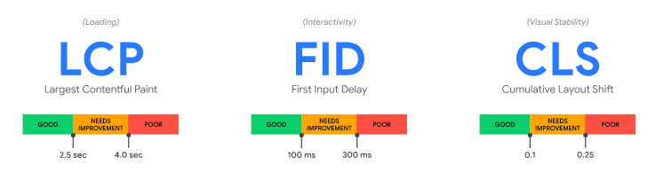

### 目的

前端需要做一个简单的监控方案，只需要监控到页面的异常和性能即可。

### 监控方案
#### 以用户体验为中心的性能指标
侧重于用户体验的三个方面——加载性能、交互性和视觉稳定性——并包括以下指标（及各指标相应的阈值）：



- [Largest Contentful Paint (LCP)](https://web.dev/lcp/) ：最大内容绘制，测量加载性能。为了提供良好的用户体验，LCP 应在页面首次开始加载后的2.5 秒内发生。
- [First Input Delay (FID)](https://web.dev/fid/) ：首次输入延迟，测量交互性。为了提供良好的用户体验，页面的 FID 应为100 毫秒或更短。
- [Cumulative Layout Shift (CLS)](https://web.dev/cls/) ：累积布局偏移，测量视觉稳定性。为了提供良好的用户体验，页面的 CLS 应保持在 0.1. 或更少。

这三个指标都可以通过 `Performance` 接口获直接或者间接获取到，当然谷歌提供了完成的解决方案 [web-vitals](https://www.npmjs.com/package/web-vitals):

``` ts
import { onLCP, onFID, onCLS } from 'web-vitals';

onCLS(monitorPref); 
onFID(monitorPref);
onLCP(monitorPref); 

```

#### 内存监控
浏览器在 `performance` 对象上加上了 `memory` 属性，通过获取 `performance.memory` 可以得到一组当前页面使用内存数据的信息。具体如下：
- `jsHeapSizeLimit`：表示当前页面最多可以获得的 JavaScript 堆大小；
- `totalJSHeapSize`：表示当前页面已经分配的 JavaScript 堆大小；
- `usedJsHeapSize`：表示当前页面 JavaScript 已经使用的堆大小。
  
浏览器在分配内存的时候，会一次性向系统申请一块内存，然后在 JavaScript 需要的时候直接提供使用，因而 `totalJSHeapSize` 总是大于 `usedJsHeapSize` 的。如果 JavaScript 需要的内存多于已经申请的量，就会继续申请一块，直到达到 `jsHeapSizeLimit` 的上限，触发页面崩溃。

通过观察 `jsHeapSizeLimit` 和 `totalJSHeapSize` 这两个字段，可以用于监控当前的页面是否有耗尽内存的危险；同时，如果内存一直在涨，不见回落，很可能需要排查是否有潜在的内存泄漏危险。

Electron的nodejs端同理，用`process.getHeapStatistics()`获取内存相关数据

```js
// web端
setInterval(() => {
    // @ts-ignore
    const memory = performance.memory;
    // # bytes / KB / MB / GB
    const limit =
      Math.round((memory["jsHeapSizeLimit"] / 1024 / 1024) * 100) / 100;
    const total =
      Math.round((memory["totalJSHeapSize"] / 1024 / 1024) * 100) / 100;
    if (limit - total < 500) {
      console.log("memory leak");
    }
    // console.log(`Heap limit ${limit} MB`);
    // console.log(`Heap total ${total} MB`);
  }, 5 * 1000);
// 主进程端
setInterval(() => {
    // @ts-ignore
    const memory = process.getHeapStatistics();
    const limit =
      Math.round((memory["heapSizeLimit"] / 1024) * 100) / 100;
    const total =
      Math.round((memory["totalHeapSize"] / 1024) * 100) / 100;
    if (limit - total < 500) {
      console.log("memory leak");
    }
    // console.log(`Heap limit ${limit} MB`);
    // console.log(`Heap total ${total} MB`);
  }, 5 * 1000);

```


#### Electron崩溃监控 

```js
// 渲染进程崩溃
app.on('render-process-gone', (event, webContents, details) => {
  console.warn('app:render-process-gone', event, webContents, details);
});
// 子进程崩溃
app.on('child-process-gone', (event, details) => {
  console.warn('app:child-process-gone', event, details);
});

```

#### 异常捕获
1. 代码异常和资源加载异常
``` ts
window.addEventListener('error', (event) => {
  let type = '';
  if (event.target instanceof Image) { // 资源加载异常
     type = 'resource error';
   } else if (event.target instanceof HTMLLinkElement) { // 资源加载异常
     type = 'resource error';
   } else {
     type = 'code error';
   }
}, true);
```

2. 代码报错和promise报错
``` ts
window.addEventListener('unhandledrejection', (event) => {
    const { reason, timeStamp } = event;
    const { message, stack } = reason;
    const url = window.location.href;
    const type = 'code error';
    log.error({ message, stack, url, timeStamp, type });
  }, true);
```

3. http请求异常，这个一般会封装到全局的`fetch`方法里统一处理

### 参考资料
1. [一文摸清前端监控自研实践（三）错误监控](https://juejin.cn/post/7100841779854835719/#heading-23)
2. [Web 指标](https://web.dev/vitals/)
3. [web-vitals](https://www.npmjs.com/package/web-vitals)
4. [你需要了解的Node.js内存限制](https://segmentfault.com/a/1190000041265668)